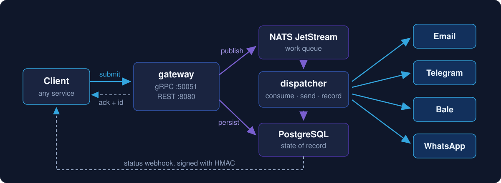

<p align="center">
  
</p>

<p align="center">
  <a href="https://go.dev"></a>
  
  
  <a href="LICENSE"></a>
</p>

**Srosha** is an asynchronous notification service written in Go. A client submits
a notification once; the service acknowledges immediately and delivers it out of
band across four channels — **Email, Telegram, Bale and WhatsApp** — with
at-least-once delivery and per-channel retry. Final status is retrieved by
polling with the returned id, or pushed to a registered webhook signed with HMAC.

The name comes from *Soroush* (سروش), the messenger in Persian culture — hence
the folded-paper bird: the message itself, folded into a crane that flies and
delivers.

## How it works

<p align="center">
  
</p>

Two independently deployable binaries share one core:

| Binary | Responsibility |
| --- | --- |
| **gateway** | Accepts requests over gRPC, authenticates, rate-limits, persists, publishes to the queue, returns an immediate ack |
| **dispatcher** | Consumes from NATS JetStream, performs the actual send per channel, records the outcome, fires status webhooks |

The split exists so intake and delivery scale and fail independently: a broken
channel integration must never stop request intake.

Under the hood, the service follows a hexagonal architecture — the domain core
knows nothing about gRPC, PostgreSQL or NATS, and every technology hangs off a
port. The full design is documented in [docs/ARCHITECTURE.md](docs/ARCHITECTURE.md).

## Talking to it

gRPC is the only surface, so every client library is a gRPC client and
`api/proto/notification/v1` is the one contract behind all of them.

```bash
go get github.com/Serajian/srosha/sdk/go
```

```go
c, _ := srosha.New(ctx, "srosha.acme.test:443", apiKey)
defer c.Close()

c.Submit(ctx, srosha.Message{
    Title: "Your order shipped",
    Body:  "Tracking: 123",
    Routes: []srosha.Route{
        srosha.Email("a@b.test"),
        srosha.Telegram("123456789"),
    },
})
```

Sending identities are registered once and never mentioned again; a message
names a channel, not an identity. See [`sdk/go`](sdk/go/README.md), and
[`sdk/`](sdk/README.md) for the rule every language SDK follows.

## Getting started

Requires Go 1.26, Docker, and `make`.

```bash
# start the local dependencies (PostgreSQL + NATS with JetStream)
make dev-up

# run the binaries locally
make run-gateway
make run-dispatcher
```

Configuration is environment variables only, prefixed `NOTIF_`; every key with
its default is documented in [`.env.example`](.env.example). `make help` lists
every build, test and migration target.

## Project layout

```
cmd/            entrypoints: gateway, dispatcher
api/proto/      protobuf definitions (buf)
internal/       everything that knows what srosha is
  core/         domain + use cases — no infrastructure imports
  adapter/      driving (gRPC, HTTP) and driven (DB, queue, providers) adapters
  infra/        one package per technology: connect, health-check, close
  registry/     the only place a technology is opened
  bootstrap/    wires a binary together and shuts it down in order
  config/       environment configuration, loaded once at startup
pkg/            generic packages with zero domain knowledge
sdk/            what a customer imports — one module per language
docs/           architecture, conventions, config, change reports
```

`make arch-check` enforces the dependency rule on every commit.

## Status

Srosha is under active development and not yet released. What stands today:
the infrastructure layer (PostgreSQL, NATS, HTTP, telemetry), configuration,
lifecycle wiring for both binaries, and readiness endpoints. The public API
surface and the channel senders are being built next.

Scope for the MVP is deliberately narrow: text content only (plain, Markdown,
HTML), no attachments, no scheduling, no templating.

## Documentation

- [Architecture](docs/ARCHITECTURE.md) — the binding design document
- [Conventions](docs/CONVENTIONS.md) — the rules every change follows
- [Config](docs/CONFIG.md) — every address, port, path and key in one place
- [Change reports](docs/changes/) — this project's memory, one file per change

## License

[MIT](LICENSE)
